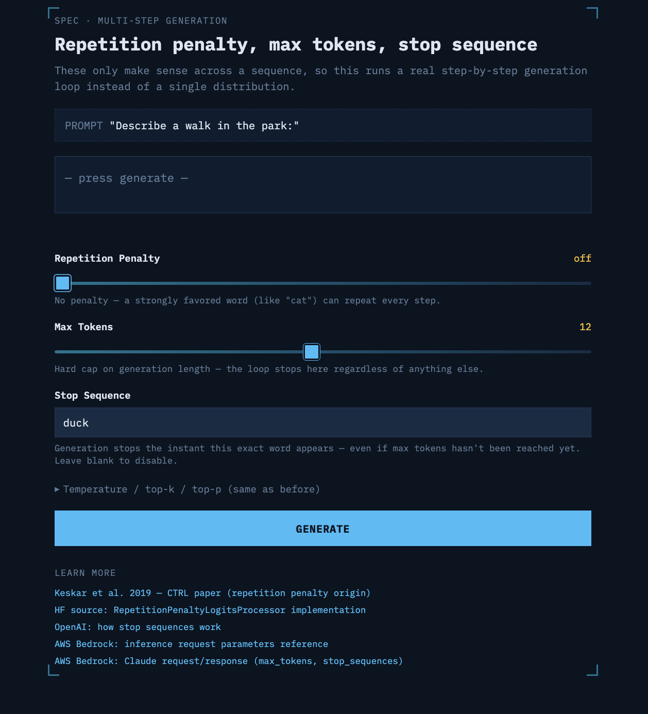

# Generation Blueprint

An interactive explainer for **repetition penalty**, **max tokens**, and **stop sequences** — the decoding controls that only make sense across a *sequence* of generation steps, not a single token distribution.

Part of the [Blueprint](https://ajithshetty.github.io/scd-blueprint/) series of data/ML engineering explainers. Companion to [`generation-blueprint`](https://github.com/ajithshetty/llm-generation-blueprint) (temperature / top-k / top-p).

**[Live demo →](https://ajithshetty.github.io/llm-generation-blueprint/)**



## What it does

Runs an actual token-by-token generation loop for the prompt `"Describe a walk in the park:"`, so the effect of each control is visible over time instead of in a single static distribution:

- **Repetition penalty** — pushes down logits for already-used tokens each step, so a strongly favored word (e.g. "cat") stops repeating every turn once it's on
- **Max tokens** — hard cap on generation length; the loop stops here regardless of anything else
- **Stop sequence** — generation halts the instant a chosen word is produced, even mid-cap
- Temperature / top-k / top-p are also wired in (collapsed by default) since they still drive each step's sampling

A "last step" panel shows the top candidates competing at each point, and the output tape grows live as the loop runs.

## Quickstart

```bash
git clone https://github.com/ajithshetty/generation-blueprint.git
cd generation-blueprint
npm install
npm run dev
```

Open `http://localhost:5173`.

### Build & deploy

```bash
npm run build
```

Deployed via GitHub Actions to GitHub Pages on push to `main` (see `.github/workflows/deploy.yml`).

## Tech stack

- React + Vite
- Plain SVG/CSS (no chart library) for full control over the blueprint aesthetic
- No backend — the generation loop and sampling math run entirely client-side

## Sources

The mechanics follow the primary references, not folk knowledge:

- [Keskar et al., 2019 — CTRL paper](https://arxiv.org/abs/1909.05858) (origin of the repetition penalty formula)
- [Hugging Face source — `RepetitionPenaltyLogitsProcessor`](https://github.com/huggingface/transformers/blob/main/src/transformers/generation/logits_process.py)
- [OpenAI — how stop sequences work](https://help.openai.com/en/articles/5072263-how-do-i-use-stop-sequences-in-the-openai-api)
- [AWS Bedrock — inference request parameters reference](https://docs.aws.amazon.com/bedrock/latest/userguide/model-parameters.html)
- [AWS Bedrock — Claude request/response (max_tokens, stop_sequences)](https://docs.aws.amazon.com/bedrock/latest/userguide/model-parameters-anthropic-claude-messages-request-response.html)

## Related

- [`llm-sampling-blueprint`](https://github.com/ajithshetty/llm-sampling-blueprint) — the single-step distribution explorer for temperature, top-k, and top-p

## Built with love from Claude and Cursor